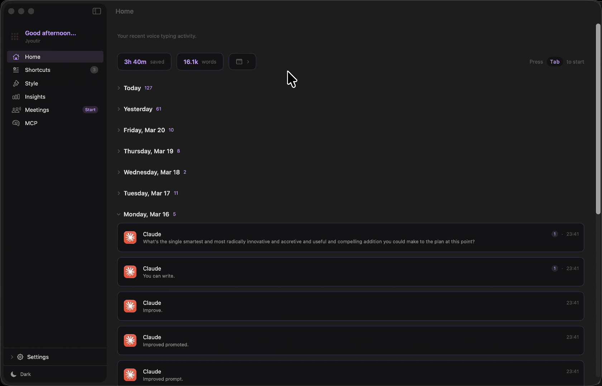
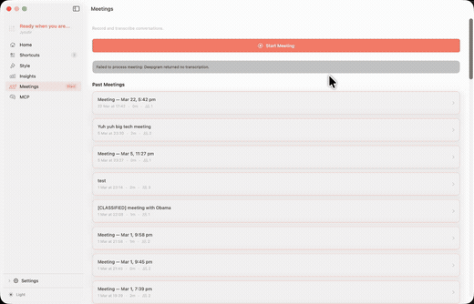

<h1 align="center">thinkur</h1>

<p align="center">
  Free, open-source voice-to-text for macOS. Dictation + meeting recording, 100% local.<br>
  Your audio never leaves your Mac.
</p>

<p align="center">
  <a href="https://github.com/jyoutir/thinkur/blob/main/LICENSE"></a>
  <a href="https://thinkur.app"></a>
  
  
</p>

<p align="center">
  <a href="https://thinkur.app">Website</a> · <a href="https://github.com/jyoutir/thinkur-web/releases/latest">Download</a> · <a href="https://github.com/jyoutir/thinkur/issues">Issues</a>
</p>

<p align="center">
  
</p>

## Why thinkur?

i didn't want to pay $12/month for wispr flow or have my audio sent to the cloud. so i built my own.

| | thinkur | Wispr Flow | Otter.ai | Superwhisper |
|---|---|---|---|---|
| Price | **$0 forever** | $144/yr | $100/yr | $85/yr |
| Local processing | **Yes** | No (cloud) | No (cloud) | Yes |
| Open source | **MIT** | No | No | No |
| Meeting recording | **Yes** | No | Yes | No |
| AI integration (MCP) | **Yes** | No | No | No |
| Speaker labels | **Yes** | No | Yes | No |
| Per-app styles | **Yes** | Yes | No | No |

## Features

- **Dictate into any app** — speak naturally, get clean text. works in 40+ apps (VS Code, Slack, Chrome, Notion, etc)
- **Meeting recording** — speaker labels, searchable transcripts, stored locally on your Mac
- **MCP integration** — Claude, ChatGPT, and Cursor can read your transcripts directly
- **Smart post-processing** — removes filler words, formats numbers, adapts writing style per app
- **Self-correction** — say "no wait, I meant..." and it keeps only the correction
- **Beautiful UI** — insights dashboard, 12 themes, dark/light mode, keyboard shortcuts
- **100% offline** — on-device via Apple's speech framework. no cloud, no accounts, no tracking
- **MIT licensed** — read every line of code. your data is yours

## Demo

https://github.com/user-attachments/assets/thinkur-demo-dubbed.mp4

> *Full demo with audio — dictation, meeting recording, and MCP in action*

## In Action

<p align="center">
  
  <br>
  <em>Dictation — speak naturally, clean text appears</em>
</p>

<details>
<summary>Meeting recording with speaker labels</summary>
<br>
<p align="center">
  
</p>
</details>

<details>
<summary>MCP — Claude & ChatGPT reading your transcripts</summary>
<br>
<p align="center">
  
</p>
</details>

<details>
<summary>Full app walkthrough</summary>
<br>
<p align="center">
  
</p>
</details>

## Install

Download the latest DMG from [**thinkur.app**](https://thinkur.app) or [Releases](https://github.com/jyoutir/thinkur-web/releases/latest).

Requires **macOS 15.0+** and **Apple Silicon** (M1 or later).

## Build from Source

```sh
git clone https://github.com/jyoutir/thinkur.git
cd thinkur
xcodegen generate
open thinkur.xcodeproj
```

Set your `DEVELOPMENT_TEAM` in `project.yml`, then **Cmd+R**.

## How It Works

Press your hotkey (default: Tab) → speak naturally → press again → cleaned text is pasted at your cursor.

| Stage | What it does |
|-------|-------------|
| Self-correction | "no wait, I meant..." → keeps only the correction |
| Filler removal | "um", "like", "you know" → removed |
| Smart formatting | "twenty five dollars" → "$25" |
| Pause punctuation | Natural pauses → commas and periods |
| Style adaptation | Learns formatting per app |

## Architecture

```
Hotkey → AudioCapture → TranscriptionEngine → PostProcessor → PasteAtCursor
         (AVAudioEngine)  (Parakeet TDT 0.6B)   (9 stages)    (Cmd+V)
```

## Contributing

Issues and pull requests welcome. Please open an issue first for major changes.

## License

[MIT](LICENSE)

---

<p align="center">
  built by <a href="https://jyoutir.com">jyo</a> · <a href="https://thinkur.app">thinkur.app</a>
</p>
