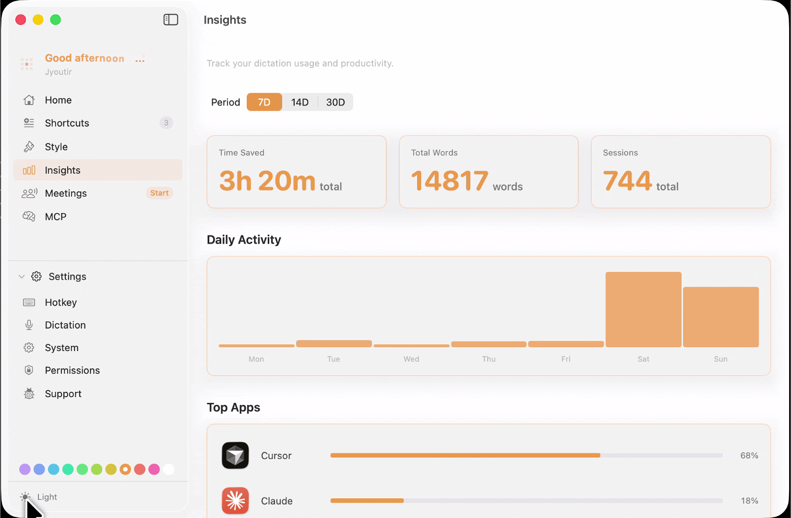

<h1 align="center">thinkur</h1>

<p align="center">
  Offline voice-to-text for macOS. Tap a hotkey, speak, text appears at your cursor.<br>
  100% local — your audio never leaves your Mac.
</p>

<p align="center">
  
</p>

## Why thinkur?

Unlike Wispr Flow and other cloud dictation tools, thinkur is **free**, **faster** (zero network latency), and **completely local**. Your audio never touches a server.

| | thinkur | Wispr Flow / cloud tools |
|---|---|---|
| Price | Free, forever | ~$180/yr subscription |
| Speed | Instant (on-device CoreML) | Limited by network round-trip |
| Privacy | Audio stays on your Mac | Audio sent to vendor servers |
| Offline | Works without internet | Requires connection |
| Account | None needed | Sign-up required |

## Features

- **4x faster than typing** — speak naturally, get clean text instantly
- **100% offline** — on-device transcription via CoreML, no cloud, no internet, no account
- **Smart post-processing** — removes "um"s and filler words, adds punctuation, formats numbers and currency
- **App-aware formatting** — adapts to each app (code editors, Slack, Google Docs, email)
- **Works everywhere** — Terminal, VS Code, Cursor, Notion, Slack, Chrome, Safari, Notes, and 30+ more
- **Self-correction** — say "no wait, I meant..." and it keeps only the correction
- **Privacy-first** — your voice data never leaves your machine, ever
- **Beautiful UI** — 12 accent colour themes, dark/light mode, floating waveform indicator
- **Customisable hotkey** — set any key combo to start/stop recording

## In Action

<p align="center">
  
  <br>
  <em>Dictating in Apple Notes — speak naturally, get clean text</em>
</p>

<details>
<summary>Full app walkthrough</summary>
<br>
<p align="center">
  
</p>
</details>

## Install

Download the latest DMG from [Releases](https://github.com/jyoutir/thinkur-web/releases/latest).

Requires **macOS 15.0+** and **Apple Silicon**. The speech model (~1.5 GB) downloads on first launch.

## Build from Source

```sh
git clone https://github.com/jyoutir/thinkur.git
cd thinkur
xcodegen generate
open thinkur.xcodeproj
```

Set your `DEVELOPMENT_TEAM` in `project.yml`, then **Cmd+R**.

## How It Works

Press your hotkey (default: Tab) → speak naturally → press again → cleaned text is pasted at your cursor.

The post-processing pipeline handles the messy parts of speech:

| Stage | What it does |
|-------|-------------|
| Self-correction | "no wait, I meant..." → keeps only the correction |
| Filler removal | "um", "like", "you know" → removed |
| Smart formatting | "twenty five dollars" → "$25" |
| Pause punctuation | Natural pauses → commas and periods |
| Style adaptation | Learns formatting per app |

## Architecture

```
Hotkey → AudioCapture → TranscriptionEngine → PostProcessor → PasteAtCursor
         (AVAudioEngine)  (Parakeet TDT 0.6B)   (9 stages)    (Cmd+V)
```

## Contributing

Issues and pull requests welcome. Please open an issue first for major changes.

## License

[MIT](LICENSE)
